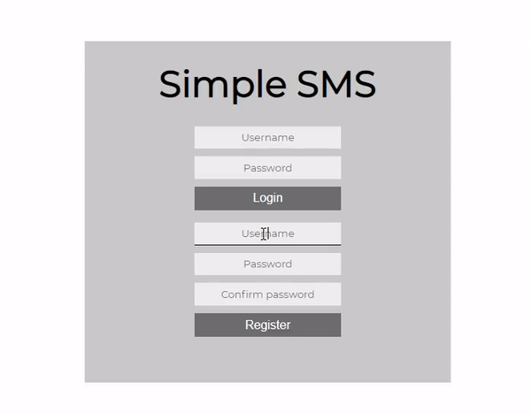
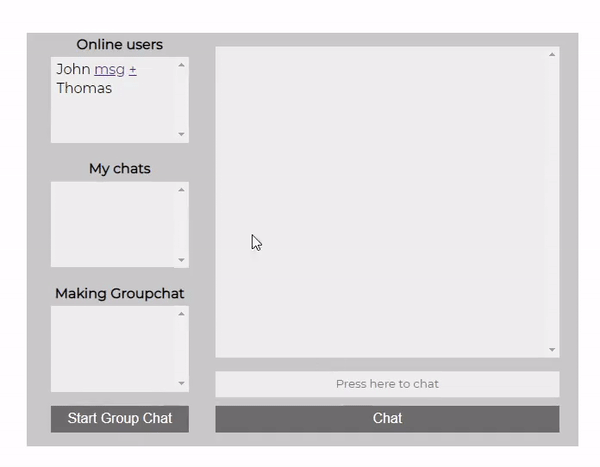
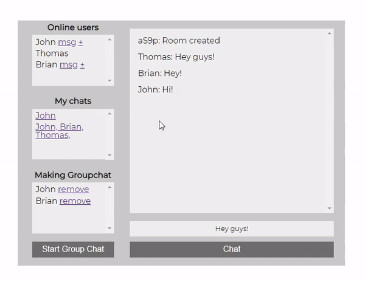

# Simple SMS
This is my simple SMS service, view the demo here: [demo](https://aloin-simple-sms.herokuapp.com/)
This app features real time messaging and persistent message data between users and groups.

## Usage
### Login / Registration
Registration or authentication is required before any services are available.
All usernames must be unique and password is hashed before storing into the database

### Messaging

To message an online user, click on the 'msg' link beside their name.
If you do not have a chat with said user, a new chat object will be created.
AFter initially messaging a user, you may message them in the future even if they are offline.
The messages will stay inside the conversation indefinitely.
Messages may only be accessed by parties that sent or recieved them.

### Group Messaging
To message a group of people, click on the '+' button beside the names of users you wish to add.
Once you are satisfied with the group, click on the "Start Group Chat" button.
A new group chat will be created and all members of the group will have access to the group chat on the side panel.
Messages are also persistent and may be sent even if others are offline.
Multiple group chats with the same people may be created.

### Accessing Old Messages

To access an old chat, click on one of the avalible existing chats to re-open them.
All messages sent in the chat are saved indefinitely.

